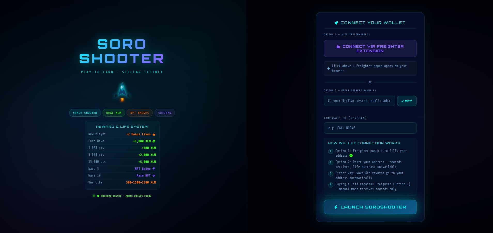
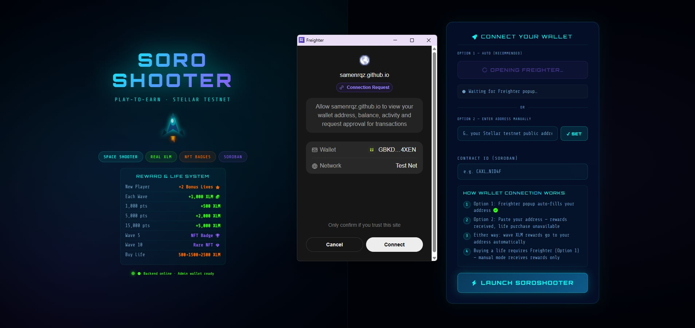
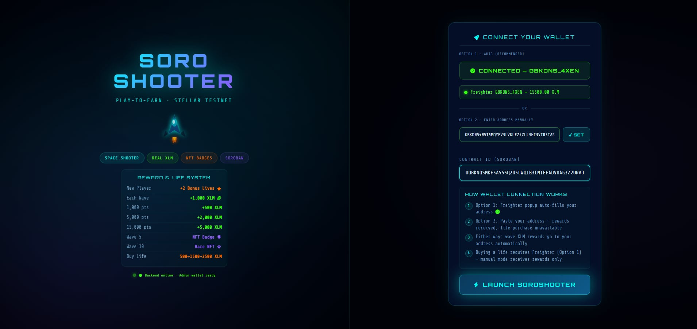
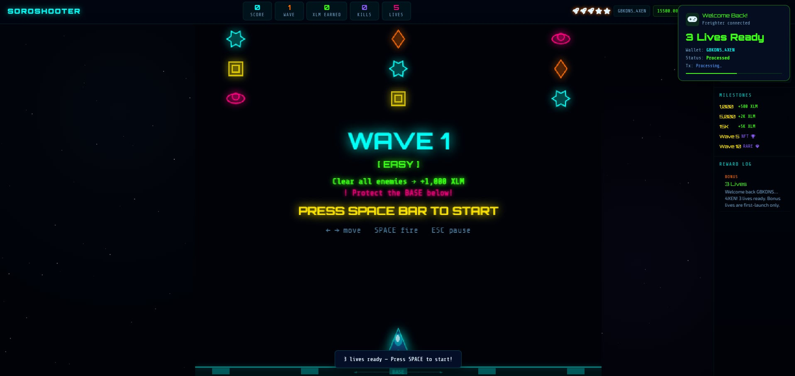
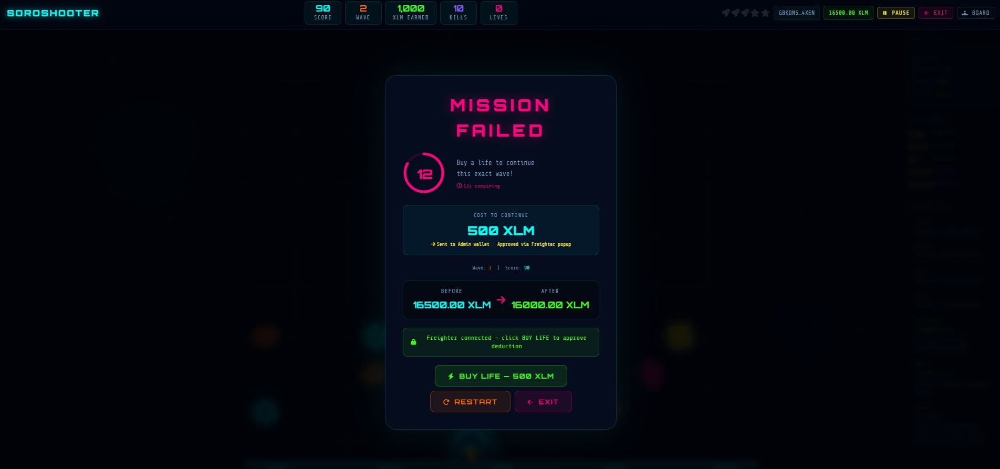
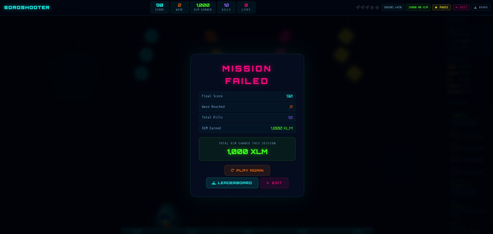
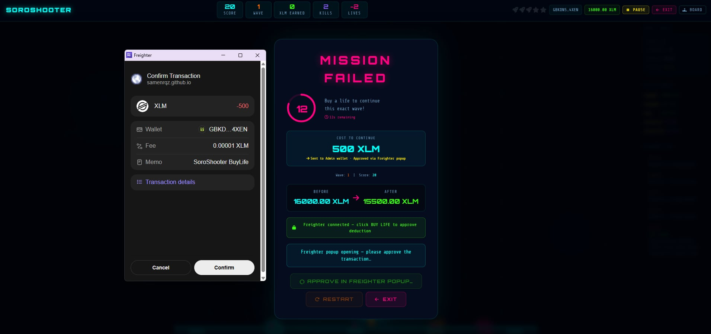
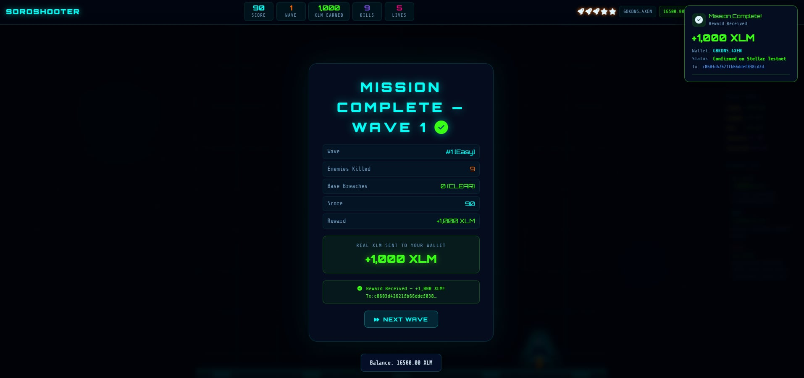

# SoroShooter — Play-to-Earn Space Shooter on Stellar

<div align="center">


**A fully on-chain play-to-earn arcade shooter built on Stellar Testnet using Soroban smart contracts.**
**Clear waves, earn real XLM. Miss a shot, lose the wave. Buy an extra life with real XLM. Everything is on-chain.**

[**Play Now**](https://samenrqz.github.io/SoroShooter/) · [Smart Contract](https://stellar.expert/explorer/testnet/contract/CAXLPNVK4FBCNWMNGNBQUJVGLZKYNDNKCOXZHTRKIFLDGZKDLSFNID4F) · [Stellar Explorer](https://stellar.expert/explorer/testnet/account/GDYK2LATZCLZN7RQYYVZ2H2YO6BZI5ZEMHR4QNVQHGEL2UIKDWJH4SYN)

</div>

---

## What Is SoroShooter?

SoroShooter is a **live, fully playable browser game** built on the Stellar blockchain. Players connect their wallet, shoot enemies, protect the base, and **earn real testnet XLM** for every wave they complete. When they die, they can pay real XLM to get an extra life — approved through the Freighter extension, no secret key ever typed.

This is not a demo. This is not a mockup. **Everything runs on Stellar Testnet in real time.**

```
Player clears wave   →  zero enemies reach base  →  +1,000 XLM sent to player wallet
Player buys a life   →  Freighter popup approves  →    -500 XLM sent to admin wallet
```

---

## The Problem

Almost every existing "play-to-earn" game either simulates transactions, uses fake centralized tokens, or forces players to paste their secret keys into a form. The result: players never actually touch the blockchain. They just see numbers change on a screen.

---

## The Solution

SoroShooter removes every layer of simulation. There is no fake token. There is no pretend transaction. When you clear a wave, a **real Stellar payment** leaves the admin wallet and arrives in your wallet — visible on Stellar Explorer, confirmed on-chain, spendable immediately.

When you buy an extra life, **Freighter opens on your own browser**, shows you the exact amount and destination, and you approve it. Your secret key never leaves the extension.

The blockchain is not a feature of SoroShooter. The blockchain **is** SoroShooter.

---

## The Killer Feature

Every other blockchain game at this hackathon either has a live game with no real on-chain activity, or has real on-chain activity with no live game.

**SoroShooter has both — simultaneously, in a single browser tab.**

Open the game, connect your Freighter wallet, clear one wave, and watch real XLM arrive in your wallet in under 60 seconds. No deployment needed. No test environment to configure.

[**Try it right now: samenrqz.github.io/SoroShooter**](https://samenrqz.github.io/SoroShooter/)

---

## MVP Scope

SoroShooter was designed, built, and deployed within the hackathon period as a complete, end-to-end working product — not a prototype, not a proof of concept.

The scope was deliberately focused: one playable game, one blockchain network, one wallet integration, real money moving in both directions. A player can open the live URL, connect their Freighter wallet, clear a wave, and receive real testnet XLM in under 60 seconds. When they die, they pay real XLM to continue. Every transaction is signed by the player on their own device, verified by the server, submitted to Stellar Testnet, and visible on Stellar Explorer with a real transaction hash.

Nothing was deferred. The game runs. The blockchain works. The money moves.

---

## Screenshots

### Login — Wallet Connection

> Two options: connect via Freighter extension (auto-fills your address and enables all features) or enter your Stellar address manually (receives rewards, but cannot buy lives).



---

### Freighter Connect — Extension Popup

> Clicking "Connect via Freighter Extension" opens the Freighter popup on your browser. No secret key is typed anywhere — only the public address is fetched.



---

### Connected — Balance Loaded

> After approval, your wallet address auto-fills and your live XLM balance is fetched from Stellar Horizon.



---

### Live Game — HUD

> Real-time score, wave number, XLM earned, lives, kills, and wallet balance at the top. Side panel shows wave details, milestones, and a live on-chain reward log.



---

### Mission Failed — Buy a Life

> On death, a 15-second countdown begins. The player can click BUY LIFE to open Freighter on their device. The secret key never leaves the extension.



---

### Mission Failed — Base Breached

> If any enemy reaches the base, the wave is lost regardless of lives remaining. The player must buy a life to retry or restart from Wave 1.



---

### Mission Retry — Life Purchased

> After Freighter approval, the XLM deduction is confirmed on-chain, the extra life is granted, and the wave restarts. The HUD balance updates automatically.


---

### Freighter — Transaction Approval

> Freighter shows the exact XLM amount and destination (admin wallet) before the player approves. This is a real Stellar transaction, not a simulation.



---

### Mission Complete — XLM Reward Sent

> All enemies destroyed, base untouched. The admin wallet sends +1,000 XLM to the player's wallet on-chain. The transaction hash is visible on screen.



---

## Key Features

| Feature | Description |
|---|---|
| **Live Gameplay** | Fully playable space shooter in the browser — no installation needed |
| **Real XLM Rewards** | +1,000 XLM per wave cleared, sent on-chain from the admin wallet |
| **Real XLM Deductions** | Extra life purchases deduct XLM from the player's Freighter wallet |
| **Freighter Signing** | No secret key ever typed — Freighter popup signs every deduction transaction |
| **Manual Address Mode** | Players can enter their address manually to receive XLM rewards without Freighter |
| **Admin Wallet Security** | Admin wallet is hardcoded and immutable — tamper attempts crash the server |
| **Mission System** | Mission Complete if base is protected, Mission Failed if any enemy reaches the base |
| **Fair Loss Rule** | Base breach = wave lost regardless of lives remaining — no exceptions |
| **NFT Badges** | Wave 5 (Uncommon) and Wave 10 (Rare) badges granted on-chain |
| **Milestone Rewards** | +500 / +2,000 / +5,000 XLM at score milestones |
| **Live Balance HUD** | Real-time XLM balance polled from Stellar Horizon after every transaction |
| **Bonus Life System** | First launch: 5 lives (3 standard + 2 bonus). Replays: 3 lives only |
| **Mobile Support** | Touch controls for mobile and tablet play |

---

## Wallet Connection Modes

SoroShooter supports two ways to connect a wallet. Choose based on what you want to do:

| | Freighter Extension (Option 1) | Manual Address (Option 2) |
|---|---|---|
| How to connect | Click "Connect via Freighter" — popup opens automatically | Paste your `G...` address and click SET |
| Receive wave XLM rewards | Yes | Yes |
| Receive milestone rewards | Yes | Yes |
| Buy an extra life | Yes — Freighter signs the payment | No — signing requires Freighter |
| Secret key exposure | None — key stays in extension | None — no key is entered |
| Recommended for | Full gameplay experience | Watching rewards, testing, demos |

---

## How to Play

### Step 1 — Connect Your Wallet

**Option A — Freighter Extension (Full Features)**
Click **Connect via Freighter Extension**. The Freighter popup opens, you approve, and your address and balance load automatically. All features including buying lives are available.

**Option B — Manual Address (Rewards Only)**
Paste your Stellar testnet `G...` public address and click **SET**. You will receive all XLM wave and milestone rewards. Buying an extra life is not available in this mode — it requires Freighter to sign the payment.

### Step 2 — Enter Contract ID and Launch

Enter your Soroban Contract ID (format: `CAXL...NID4F`) and click **Launch SoroShooter**.

### Step 3 — Controls

| Control | Action |
|---|---|
| `Left / Right Arrow` or `A / D` | Move ship |
| `SPACE` | Fire (triple shot unlocks at Wave 5) |
| `ESC` or `P` | Pause / Resume |
| Touch left / right buttons | Mobile movement |
| Touch fire button | Mobile fire |

### Step 4 — Win Condition (Mission Complete)

Destroy **all enemies** without letting any reach the base. The admin wallet automatically sends **+1,000 XLM** to your address on-chain. The transaction hash is shown on screen.

### Step 5 — Lose Condition (Mission Failed)

If **any enemy reaches the base**, the wave is lost — regardless of how many lives you have left. You must buy an extra life to retry, or restart from Wave 1.

### Step 6 — Buy an Extra Life (Freighter mode only)

On death, a 15-second countdown starts. Click **BUY LIFE — RETRY**. Freighter opens on your device, shows the exact cost and destination, and you approve. The XLM is deducted from your wallet and sent to the admin wallet on-chain. The wave then restarts from the beginning.

Life cost escalates per session:

| Purchase | Cost |
|---|---|
| 1st extra life | 500 XLM |
| 2nd extra life | 1,500 XLM |
| 3rd extra life | 2,500 XLM |
| nth extra life | 500 + (n-1) x 1,000 XLM |

---

## Reward System

```
Condition                              Reward         Destination
----------------------------------------------------------------------
Wave cleared (0 enemies reach base)    +1,000 XLM  →  player wallet
Score reaches 1,000 pts                  +500 XLM  →  player wallet
Score reaches 5,000 pts                +2,000 XLM  →  player wallet
Score reaches 15,000 pts               +5,000 XLM  →  player wallet
Wave 5 cleared                         NFT Badge (Uncommon)
Wave 10 cleared                        NFT Badge (Rare)
```

Rewards go to the address set at login — whether connected via Freighter or entered manually.

---

## Security Model

**Zero secret keys in any source file. Zero secret keys typed by the player. Ever.**

```
EXTRA LIFE — Freighter Signing Flow
================================================================

  Server builds an unsigned payment XDR
  (player address  →  admin wallet,  exact XLM cost)
                    |
                    v
  window.freighterApi.signTransaction(xdr)
                    |
                    v
  Freighter popup opens on the player's own browser
  Player sees: amount, destination, network
                    |
                    v
  Player clicks Approve
                    |
                    v
  { signedTxXdr } returned to the frontend
  Secret key NEVER leaves the Freighter extension
                    |
                    v
  Frontend sends signedTxXdr to the Node.js server
                    |
                    v
  Server verifies:
    destination === ADMIN_WALLET  (hardcoded, cannot be changed)
    amount      >= expected cost
                    |
                    v
  Server submits to Stellar Testnet via Horizon API
                    |
                    v
  XLM deducted from player wallet
  Extra life granted
  Wave restarts
```

### Admin Wallet Integrity — 5 Independent Locks

The admin wallet (`GDYK2LATZCLZN7RQYYVZ2H2YO6BZI5ZEMHR4QNVQHGEL2UIKDWJH4SYN`) cannot be changed by anyone:

| Lock | Location | What it does |
|---|---|---|
| Hardcoded constant | `server.js` | `ADMIN_PUBLIC` is a plain constant — no env override possible |
| Server startup check | `server.js` | Server refuses to start if `ADMIN_PUBLIC` has been modified |
| Submit-tx verification | `server.js` | Rejects any XDR where destination does not match `ADMIN_PUBLIC` |
| Page load check | `index.html` | Stops the page immediately if `ADMIN_WALLET` has been changed |
| Pre-transaction check | `index.html` | Verifies `ADMIN_WALLET` before every single life purchase |

---

## Architecture

```
BROWSER (HTTPS — GitHub Pages)
  index.html
  ├── Game Engine (Canvas 2D, vanilla JavaScript)
  ├── @stellar/freighter-api v5 (loaded from cdnjs)
  ├── stellar-sdk v11 (loaded from cdnjs)
  ├── Wallet Mode A: Freighter auto-connect (full features)
  ├── Wallet Mode B: Manual address entry (rewards only)
  └── Admin wallet integrity checks on page load and per transaction
           |
           | REST / JSON over HTTP
           v
NODE.JS BACKEND (Express — runs locally)
  server.js
  ├── GET  /health                  server status
  ├── GET  /api/diagnose            full config check
  ├── GET  /api/balance/:address    player XLM balance
  ├── POST /api/reward/wave         send +1,000 XLM to player
  ├── POST /api/reward/milestone    send milestone reward to player
  ├── POST /api/life/build-tx       build unsigned payment XDR
  └── POST /api/life/submit-tx      verify + submit signed XDR
           |
           | Stellar SDK / Horizon API
           v
STELLAR TESTNET
  Horizon:   https://horizon-testnet.stellar.org
  Contract:  CAXLPNVK4FBCNWMNGNBQUJVGLZKYNDNKCOXZHTRKIFLDGZKDLSFNID4F
  Admin:     GDYK2LATZCLZN7RQYYVZ2H2YO6BZI5ZEMHR4QNVQHGEL2UIKDWJH4SYN [LOCKED]
```

---

## Project Setup Guide

> Step-by-step instructions to run SoroShooter locally.
> Works on **Windows, macOS, and Linux**.

### What You Need Before Starting

| Tool | Version | Where to get it |
|---|---|---|
| Node.js | v18 or higher | [nodejs.org](https://nodejs.org/) |
| Git | Any recent version | [git-scm.com](https://git-scm.com/) |
| Freighter Wallet | Latest | [freighter.app](https://freighter.app/) |

Check Node.js is installed:

```bash
node --version    # must be v18 or higher
npm --version     # must be 9 or higher
```

---

### Step 1 — Clone the Repository

```bash
git clone https://github.com/samenrqz/SoroShooter.git
cd SoroShooter
```

---

### Step 2 — Install Backend Dependencies

```bash
npm install express cors stellar-sdk dotenv
```

---

### Step 3 — Create the `.env` File

Create a file named exactly `.env` in the project root (same folder as `server.js`):

```
ADMIN_SECRET=S...your_admin_wallet_secret_key
```

> **Important:** Never commit this file to GitHub. Make sure your `.gitignore` includes `.env`.

---

### Step 4 — Fund the Admin Wallet

The admin wallet must have testnet XLM to pay out wave rewards. Fund it for free:

```
https://friendbot.stellar.org/?addr=GDYK2LATZCLZN7RQYYVZ2H2YO6BZI5ZEMHR4QNVQHGEL2UIKDWJH4SYN
```

---

### Step 5 — Start the Server

```bash
node server.js
```

You should see:

```
╔══════════════════════════════════════════╗
║   SoroShooter API  —  Port 3001          ║
╚══════════════════════════════════════════╝
Network  : Stellar Testnet
Admin    : GDYK2LAT... [LOCKED]
Secret   : loaded from .env
Ready! Open http://localhost:3001/api/diagnose to verify config
```

> Keep this terminal open while playing. The server must be running for all rewards and life purchases to work.

---

### Step 6 — Verify the Configuration

Open this in your browser while the server is running:

```
http://localhost:3001/api/diagnose
```

All fields must be `true` and `error` must be `null`:

```json
{
  "admin_public": "GDYK2LAT...",
  "secret_set": true,
  "secret_valid": true,
  "secret_matches": true,
  "admin_balance": 10000,
  "admin_funded": true,
  "error": null
}
```

If anything is wrong, see the [Troubleshooting](#troubleshooting) section below.

---

### Step 7 — Set Up Freighter

1. Install [Freighter](https://freighter.app/) in Chrome, Brave, or Firefox
2. Create or import a Stellar wallet inside the extension
3. Go to **Settings → Network → select Testnet**
4. Fund your player wallet at: `https://friendbot.stellar.org/?addr=YOUR_ADDRESS`

---

### Step 8 — Open the Game

> **Important:** Freighter only works on HTTPS. Do not open `index.html` directly from your file system or from `http://localhost`.

The game is already live at:

```
https://samenrqz.github.io/SoroShooter/
```

To deploy your own copy to GitHub Pages:

```bash
git add .
git commit -m "deploy"
git push
# Then: repo Settings → Pages → Source: main branch → Save
```

---

### Pre-Launch Checklist

Before clicking Play, confirm all of these:

- [ ] `node server.js` is running and showing no errors
- [ ] `http://localhost:3001/api/diagnose` returns `"error": null`
- [ ] Freighter is installed and set to **Testnet**
- [ ] Your player wallet is funded (use Friendbot)
- [ ] You are opening the game from `https://` not `http://`

---

## For Developers — Rebuilding the Smart Contract

> Only needed if you want to modify and redeploy the Soroban contract from scratch.

### Install Rust and Wasm Target

```bash
# macOS / Linux
curl --proto '=https' --tlsv1.2 -sSf https://sh.rustup.rs | sh
rustup target add wasm32-unknown-unknown

# Windows — download the installer from https://rustup.rs, then run:
rustup target add wasm32-unknown-unknown

# Verify
rustc --version
cargo --version
```

### Install Stellar CLI

```bash
cargo install --locked stellar-cli --features opt
stellar --version
```

Full guide: [Stellar CLI Docs](https://developers.stellar.org/docs/tools/developer-tools/cli/install-cli)

### Generate and Fund a Testnet Wallet

```bash
stellar keys generate --global admin-wallet --network testnet

# Fund it
# macOS / Linux:
curl "https://friendbot.stellar.org/?addr=$(stellar keys address admin-wallet)"

# Windows PowerShell:
Invoke-WebRequest "https://friendbot.stellar.org/?addr=$(stellar keys address admin-wallet)"

# Check balance
stellar account show --address $(stellar keys address admin-wallet) --network testnet
```

### Build the Contract

```bash
cargo build --target wasm32-unknown-unknown --release
```

Output: `target/wasm32-unknown-unknown/release/soroban_community_treasury.wasm`

### Run Tests

```bash
cargo test
```

Expected output:

```
running 50 tests
test test::test_initialize_stores_config ... ok
test test::test_full_proposal_lifecycle_pass ... ok
...
test result: ok. 50 passed; 0 failed; 0 ignored
```

### Deploy to Testnet

```bash
stellar contract deploy \
  --wasm target/wasm32-unknown-unknown/release/soroban_community_treasury.wasm \
  --source admin-wallet \
  --network testnet
```

Copy the Contract ID from the output. Paste it into the game's login screen.

### Initialize the Contract

```bash
stellar contract invoke \
  --id <YOUR_CONTRACT_ID> \
  --source admin-wallet \
  --network testnet \
  -- initialize \
  --admin <ADMIN_ADDRESS>
```

---

## Project Structure

```
SoroShooter/
├── index.html          # Complete frontend — game engine + blockchain UI
├── server.js           # Node.js backend — Horizon API + reward + signing logic
├── .env                # Admin secret key — NEVER commit this file
├── .gitignore          # Excludes .env and node_modules
├── UIscreenshots/      # Screenshots used in this README
└── README.md
```

---

## Blockchain Details

| Item | Value |
|---|---|
| Network | Stellar Testnet |
| Soroban Contract | `CAXLPNVK4FBCNWMNGNBQUJVGLZKYNDNKCOXZHTRKIFLDGZKDLSFNID4F` |
| Admin Wallet | `GDYK2LATZCLZN7RQYYVZ2H2YO6BZI5ZEMHR4QNVQHGEL2UIKDWJH4SYN` |
| Freighter API | `@stellar/freighter-api` v5.0.0 (cdnjs) |
| Stellar SDK | `stellar-sdk` v11.3.0 |
| Horizon URL | `https://horizon-testnet.stellar.org` |

---

## Tech Stack

| Layer | Technology |
|---|---|
| Frontend | Vanilla HTML / CSS / JavaScript · Canvas 2D |
| Wallet | Freighter Extension · `@stellar/freighter-api` v5 |
| Icons | Font Awesome 6 Free (cdnjs) |
| Blockchain | Stellar Testnet · Soroban Smart Contracts |
| Backend | Node.js · Express · `stellar-sdk` |
| Fonts | Orbitron · Share Tech Mono · Exo 2 (Google Fonts) |
| Deployment | GitHub Pages (HTTPS) |

---

## Wave Difficulty

| Waves | Difficulty | Enemy Speed | Notes |
|---|---|---|---|
| 1–4 | Easy | 1.0x | First launch gets 5 lives (3 standard + 2 bonus) |
| 5–9 | Medium | 1.58x | Triple shot unlocks at Wave 5 · NFT badge awarded |
| 10+ | Hard | 2.45x | Maximum difficulty · Rare NFT badge at Wave 10 |

Replaying after game over gives 3 lives only. The 2 bonus lives are a first-launch reward.

---

## Troubleshooting

### Freighter is not detected on the login screen

Freighter only works on HTTPS pages. It will not inject on `http://localhost` or when opening `index.html` directly from the file system.

| Where the game is opened | Freighter works? |
|---|---|
| `https://samenrqz.github.io/SoroShooter/` | Yes |
| `http://localhost:5500` (VS Code Live Server) | No |
| File opened directly (`file:///...`) | No |

Always use the live GitHub Pages URL.

---

### Wave reward fails — error appears on Mission Complete screen

Run the diagnose endpoint while the server is running:

```
http://localhost:3001/api/diagnose
```

Match the `error` field to the table below:

| Error message | What it means | How to fix |
|---|---|---|
| `ADMIN_SECRET not set in .env` | The `.env` file is missing or the key is not set | Create `.env` with `ADMIN_SECRET=S...` next to `server.js` |
| `secret_matches: false` | The secret key controls a different wallet | Use the secret key that matches the admin wallet address |
| `Admin only has X XLM` | Admin wallet balance is too low | Fund it: `https://friendbot.stellar.org/?addr=GDYK2LAT...` |
| `ADMIN_SECRET is not a valid key` | The key is malformed or truncated | Copy the full `S...` key again carefully |
| `error: null` | Everything is correct | Restart `node server.js` and try again |

After any fix, always restart the server: `Ctrl+C` then `node server.js`

---

### Server shows `Cannot GET /api/diagnose`

You are running an old version of `server.js` that does not have the diagnose route. Replace it with the latest version and restart.

---

### Balance does not update after buying a life

Stellar takes 2–5 seconds to confirm a transaction. The game polls every 2.5 seconds for up to 30 seconds after a confirmed purchase. Wait a moment — the HUD will update automatically. You can also click the green balance display in the top-right HUD to force a manual refresh.

---

### Freighter popup does not appear when buying a life

Check all of the following:

1. The Freighter extension is **unlocked** — open it and check
2. You are on `https://samenrqz.github.io/SoroShooter/` not localhost
3. Freighter is set to **Testnet** under Settings → Network
4. You connected via **Option 1 (Freighter)**, not manual address — manual mode cannot sign transactions
5. Refresh the page and reconnect if needed

---

### `secret_matches: false` in the diagnose output

The secret key in your `.env` belongs to a different wallet than `ADMIN_PUBLIC` in `server.js`. To find which address your secret key generates:

```bash
node -e "const S=require('stellar-sdk'); console.log(S.Keypair.fromSecret('S...YOUR_SECRET').publicKey())"
```

The address printed must match `admin_public` shown in `/api/diagnose`. If it does not, update `ADMIN_SECRET` in your `.env` to the correct key.

---

## API Reference

### `GET /health`

Returns server and configuration summary.

```json
{ "status": "ok", "admin": "GDYK2LAT...", "secret_set": true, "wave_reward": 1000 }
```

### `GET /api/diagnose`

Full configuration check. Open this in your browser to debug any reward or payment failure. Returns admin public key, secret validation, admin balance, and funded status.

### `GET /api/balance/:address`

Returns the current XLM balance of any Stellar address.

```json
{ "success": true, "balance": 13000.88 }
```

### `POST /api/reward/wave`

Sends the wave-clear reward from the admin wallet to the player.

```json
// Request
{ "playerAddress": "G...", "wave": 1 }

// Response
{ "success": true, "hash": "abc123...", "amount": 1000 }
```

### `POST /api/reward/milestone`

Sends a milestone reward from the admin wallet to the player.

```json
// Request
{ "playerAddress": "G...", "milestone": 1000 }

// Response
{ "success": true, "hash": "abc123...", "amount": 500 }
```

### `POST /api/life/build-tx`

Builds an unsigned payment XDR for the player to sign via Freighter. The transaction sends XLM from the player to the admin wallet.

```json
// Request
{ "playerAddress": "G...", "lifeBuyCount": 0 }

// Response
{
  "success": true,
  "unsignedXDR": "AAAAAgAAAAA...",
  "cost": 500,
  "networkPassphrase": "Test SDF Network ; September 2015"
}
```

### `POST /api/life/submit-tx`

Verifies the signed XDR (checks destination address and amount), then submits it to Stellar Testnet.

```json
// Request
{ "signedXDR": "AAAAAgAAAAA...", "playerAddress": "G...", "lifeBuyCount": 0 }

// Response
{ "success": true, "hash": "abc123...", "cost": 500, "lifeGranted": true }
```

---

## Future Scope

### Blockchain and On-Chain

| Idea | Description |
|---|---|
| **Mainnet Deployment** | Move from Stellar Testnet to Mainnet with real XLM at stake |
| **True NFT Badges** | Mint Wave 5 and Wave 10 badges as actual Stellar assets |
| **Full On-Chain Game Logic** | Move scoring, wave state, and life management fully into Soroban |
| **DAO Governance** | Token holders vote on reward rates and game parameters |
| **Multi-sig Admin Wallet** | Replace single admin key with a multi-signature treasury |

### Gameplay

| Idea | Description |
|---|---|
| **Multiplayer Mode** | Two players share a base and split wave rewards |
| **On-Chain Leaderboard** | Top scores stored in a Soroban contract — verifiable and tamper-proof |
| **Boss Waves** | Special high-reward waves every 5 levels with unique enemy patterns |
| **Ship Skins as NFTs** | Cosmetic skins minted as Stellar assets, tradeable on-chain |
| **Mobile App** | Native iOS/Android app with Lobstr wallet integration |

### Platform

| Idea | Description |
|---|---|
| **Tournament Mode** | Time-limited competitions with a shared on-chain prize pool |
| **Guild System** | Players form guilds, pool rewards, and compete as teams |
| **Player Dashboard** | Web dashboard showing XLM earned, transaction history, and NFT collection |
| **Cross-Game XLM** | Shared admin wallet infrastructure powering multiple Stellar mini-games |

---

## Author

**John Samuel B. Enriquez (Sam)**
2nd Year Computer Science · University of the East — Caloocan

Built for the **Stellar PH Unitour Hackathon** · March 2026

---

## License

MIT — free to fork, extend, and build your own play-to-earn game on Stellar.

---

<div align="center">

**Built on Stellar · Powered by Soroban · Signed by Freighter**

[Star this repo](https://github.com/samenrqz/SoroShooter) · [Report an issue](https://github.com/samenrqz/SoroShooter/issues) · [Play Now](https://samenrqz.github.io/SoroShooter/)

</div>