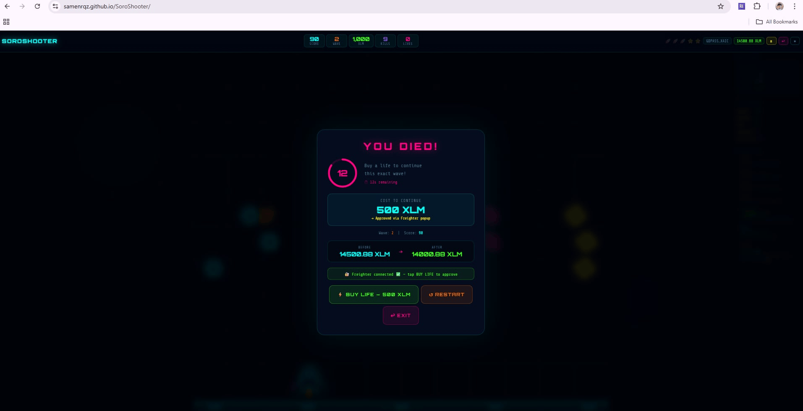
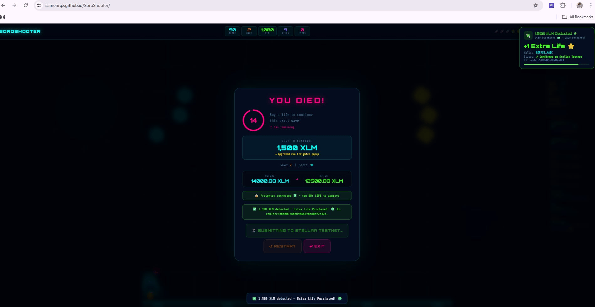
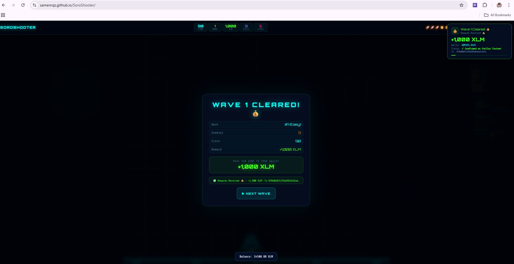

# 🚀 SoroShooter — Play-to-Earn Space Shooter on Stellar

<div align="center">


**A fully on-chain play-to-earn arcade shooter where every wave you clear pays you real XLM — and every extra life costs real XLM sent directly to the admin wallet via Freighter.**

[🎮 Play Now](https://samenrqz.github.io/SoroShooter/) · [📄 Smart Contract](https://stellar.expert/explorer/testnet/contract/CAXLPNVK4FBCNWMNGNBQUJVGLZKYNDNKCOXZHTRKIFLDGZKDLSFNID4F) · [🔍 View on Stellar Expert](https://stellar.expert/explorer/testnet)

</div>

---

## 🎯 What Is SoroShooter?

SoroShooter is a **live, playable play-to-earn game** built on the Stellar blockchain using Soroban smart contracts. Players shoot enemies, clear waves, and **earn real XLM** rewards. When they die, they can buy an extra life — which **deducts real XLM from their Freighter wallet** and sends it to the admin wallet on-chain.

No fake tokens. No simulated transactions. **Real XLM. Real Stellar Testnet.**

```
Player shoots enemies → Wave cleared → +1,000 XLM sent to player wallet ✅
Player dies          → Buy a life   → −500 XLM deducted from player wallet ✅
```

---

## 📸 UI Screenshots

### Login Screen — Wallet Connection
> Connect via Freighter extension (auto) or paste your Stellar address manually. Both options trigger a real Freighter signing popup when a life is purchased.


---

### Sign In Wallet — Freighter Connect
> The Freighter extension popup opens on the user's browser when connecting. No secret key is ever typed — only the public address is fetched.


---

### Connected Successfully
> After approving in Freighter, the wallet address is auto-filled and the balance is fetched from Stellar Testnet.


---

### Game Screen — Live HUD
> Real-time score, wave, XLM earned, lives, and wallet balance displayed at the top. Side panel shows wave info, milestones, and a live reward log.


---

### You Died — Buy a Life Countdown
> On death, a 15-second countdown appears. Clicking BUY LIFE opens a Freighter popup on the player's browser. No secret key is ever typed — the extension signs the deduction securely.



---

### Transaction for Extra Life — Freighter Approval
> Freighter shows the exact XLM amount being deducted and the destination (admin wallet). The player approves directly inside the extension.


---

### Transaction Successful — Life Purchased
> After Freighter approval, the transaction is submitted to Stellar Testnet. The game confirms the deduction and grants the extra life.



---

### Wave Cleared — XLM Reward Sent
> When all enemies are destroyed without any reaching the base, the admin wallet automatically sends +1,000 XLM to the player's wallet on-chain.



---

## ✨ Key Features

| Feature | Description |
|---|---|
| 🎮 **Live Gameplay** | Fully playable space shooter in the browser |
| 💰 **Real XLM Rewards** | +1,000 XLM per wave cleared, sent on-chain |
| 💸 **Real XLM Deductions** | Life purchases deduct XLM from your Freighter wallet |
| 🔐 **Freighter Signing** | No secret key ever typed — Freighter popup signs everything |
| 🏆 **NFT Badges** | Wave 5 (Uncommon) and Wave 10 (Rare) badges minted on-chain |
| 📈 **Milestone Rewards** | +500 / +2,000 / +5,000 XLM at score milestones |
| 🛡️ **Admin Wallet System** | Centralized treasury receives life-purchase fees |
| 📊 **Live Balance HUD** | Real-time XLM balance polled from Stellar Horizon |
| 📋 **Manual + Auto Connect** | Freighter auto-connect OR manual address entry |
| 📱 **Mobile Support** | Touch controls for mobile play |

---

## 🎮 How to Play

### 1. Connect Your Wallet

```
Option A — Auto (Recommended)
  Click "Connect via Freighter Extension"
  → Freighter popup opens on your browser
  → Approve → address auto-filled ✅

Option B — Manual
  Paste your Stellar testnet G... address
  → Freighter still opens when you buy a life
  → Your secret key is never typed anywhere
```

### 2. Launch the Game

Enter your Soroban Contract ID and click **⚡ Launch SoroShooter**.

### 3. Play

| Control | Action |
|---|---|
| `← →` or `A D` | Move ship |
| `SPACE` | Fire (triple shot unlocks at Wave 5) |
| `ESC` or `P` | Pause |
| Touch `◀ ▶` | Mobile movement |
| Touch `🔥` | Mobile fire |

### 4. Earn XLM

Every time you clear a wave with **zero enemies reaching the base**, the admin wallet sends you **+1,000 XLM** automatically.

### 5. Buy a Life

When you die, a **15-second countdown** starts. Click **⚡ BUY LIFE** — Freighter opens a popup on your browser. Approve the transaction and your life is purchased. The cost escalates:

| Purchase | Cost |
|---|---|
| 1st extra life | 500 XLM |
| 2nd extra life | 1,500 XLM |
| 3rd extra life | 2,500 XLM |
| nth extra life | 500 + (n−1) × 1,000 XLM |

---

## 💰 Reward System

```
Wave cleared (0 enemies through base)  →  +1,000 XLM  →  player wallet
Score reaches 1,000 pts                →    +500 XLM  →  player wallet
Score reaches 5,000 pts                →  +2,000 XLM  →  player wallet
Score reaches 15,000 pts               →  +5,000 XLM  →  player wallet
Wave 5 cleared                         →  NFT Badge 🏆 (Uncommon)
Wave 10 cleared                        →  NFT Badge ✨ (Rare)
```

---

## 🔐 Security Model

**Zero secret keys in any file. Zero secret keys typed by the user. Ever.**

```
BUY LIFE — Freighter Signing Flow
══════════════════════════════════════════════════════

  Server builds unsigned tx XDR
  (player → admin wallet, cost XLM)
          ↓
  window.freighterApi.signTransaction(xdr)
          ↓
  Freighter popup opens on user's browser
          ↓
  User clicks Approve
          ↓
  { signedTxXdr } returned
  (secret key NEVER leaves the extension)
          ↓
  Frontend POSTs signedTxXdr to server
          ↓
  Server verifies: destination === ADMIN_WALLET
                   amount      >= expected cost
          ↓
  Server submits to Stellar Testnet via Horizon
          ↓
  ✅ Balance decreases · Life granted · Wave restarts
```

The admin secret key (`ADMIN_SECRET`) lives **only** in the server's `.env` file, which is never committed to GitHub. Life-purchase deductions are signed entirely by the player via Freighter — the server only verifies and submits the pre-signed XDR.

---

## 🏗️ Architecture

```
┌─────────────────────────────────────────────────────────┐
│                     BROWSER (HTTPS)                      │
│                                                          │
│  index.html                                              │
│  ├── Game Engine (Canvas 2D)                             │
│  ├── @stellar/freighter-api v5 (cdnjs)                   │
│  ├── stellar-sdk v11 (cdnjs)                             │
│  └── Wallet Connection                                   │
│       ├── Option A: Freighter extension popup            │
│       └── Option B: Manual G... address                  │
└───────────────────┬─────────────────────────────────────┘
                    │ REST (JSON)
                    ▼
┌─────────────────────────────────────────────────────────┐
│                   NODE.JS BACKEND                        │
│                                                          │
│  server.js (Express)                                     │
│  ├── GET  /health                                        │
│  ├── GET  /api/diagnose          ← config checker        │
│  ├── GET  /api/balance/:address                          │
│  ├── POST /api/reward/wave       ← admin → player        │
│  ├── POST /api/reward/milestone  ← admin → player        │
│  ├── POST /api/life/build-tx     ← builds unsigned XDR   │
│  └── POST /api/life/submit-tx    ← verifies + submits    │
└───────────────────┬─────────────────────────────────────┘
                    │ Stellar SDK / Horizon API
                    ▼
┌─────────────────────────────────────────────────────────┐
│              STELLAR TESTNET                             │
│                                                          │
│  Horizon API: https://horizon-testnet.stellar.org        │
│  Soroban Contract: CAXLPNVK4FBCNWMNGNBQUJVGLZKY…        │
│  Admin Wallet: GCYDZO56GUVVMAT6PR3GHKA4XNWCXMCIE…       │
└─────────────────────────────────────────────────────────┘
```

---

## 🛠️ Project Setup Guide

> Follow these steps **in order** to run SoroShooter on your local machine.
> Works on **Windows, macOS, and Linux**.

---

### Prerequisites — Install These First

Before you begin, you need the following tools installed. Click each link to download.

| Tool | Version | Download |
|---|---|---|
| **Node.js** | v18 or higher | [nodejs.org](https://nodejs.org/) |
| **Git** | Any recent version | [git-scm.com](https://git-scm.com/) |
| **Freighter Wallet** | Latest | [freighter.app](https://freighter.app/) |

**Check Node.js is installed correctly:**

```bash
node --version
# Expected: v18.x.x or higher

npm --version
# Expected: 9.x.x or higher
```

If `node` is not recognized, install it from [nodejs.org](https://nodejs.org/) and reopen your terminal.

---

### Step 1 — Clone the Repository

**Windows (PowerShell / Command Prompt):**
```powershell
git clone https://github.com/samenrqz/SoroShooter.git
cd SoroShooter
```

**macOS / Linux (Terminal):**
```bash
git clone https://github.com/samenrqz/SoroShooter.git
cd SoroShooter
```

---

### Step 2 — Install Dependencies

Run this in the `SoroShooter` folder:

```bash
npm install express cors stellar-sdk dotenv
```

Expected output:
```
added 97 packages in 8s
```

If you see errors, make sure Node.js v18+ is installed and you are inside the `SoroShooter` folder.

---

### Step 3 — Create the `.env` File

This file holds your admin wallet secret key. It must **never** be pushed to GitHub.

**Windows (PowerShell):**
```powershell
echo ADMIN_SECRET=S...your_secret_key_here > .env
```

**macOS / Linux:**
```bash
echo "ADMIN_SECRET=S...your_secret_key_here" > .env
```

**Or create it manually** — open any text editor, create a new file named `.env` (no other extension), and paste exactly this:

```
ADMIN_SECRET=S...your_secret_key_here
```

> 📌 Replace `S...your_secret_key_here` with the actual secret key for your admin wallet.
> The admin wallet is the one that **sends XLM rewards** to players and **receives XLM** when players buy lives.

**Make sure `.gitignore` contains `.env`:**

```
.env
node_modules
```

---

### Step 4 — Fund Your Admin Wallet (if not already funded)

Your admin wallet needs testnet XLM to pay out wave rewards. Fund it for free:

1. Open your browser and go to:
   ```
   https://friendbot.stellar.org/?addr=YOUR_ADMIN_WALLET_ADDRESS
   ```
2. Replace `YOUR_ADMIN_WALLET_ADDRESS` with your actual `G...` address
3. You will receive **10,000 testnet XLM** instantly

---

### Step 5 — Start the Backend Server

**Windows (PowerShell / Command Prompt):**
```powershell
node server.js
```

**macOS / Linux:**
```bash
node server.js
```

You should see this output:
```
╔══════════════════════════════════════════╗
║   SoroShooter API  —  Port 3001          ║
╚══════════════════════════════════════════╝
📡  Network  : Stellar Testnet
💰  Admin    : GCYDZO56...
🔑  Secret   : ✅ loaded
✅ Ready! Open http://localhost:3001/api/diagnose to verify config
```

> ⚠️ Keep this terminal window open while playing the game. The server must be running for rewards and life purchases to work.

---

### Step 6 — Verify Everything Works

While the server is running, open this URL in your browser:

```
http://localhost:3001/api/diagnose
```

You should see a JSON response. All fields must be `true` and `error` must be `null`:

```json
{
  "admin_public": "GCYDZO56...",
  "secret_set": true,
  "secret_valid": true,
  "secret_matches": true,
  "admin_balance": 12000,
  "admin_funded": true,
  "error": null
}
```

If any field is wrong, go to the [Troubleshooting](#-troubleshooting) section.

---

### Step 7 — Set Up Freighter Wallet

1. Install the [Freighter extension](https://freighter.app/) in Chrome, Brave, or Firefox
2. Create or import a Stellar wallet
3. **Important:** Go to Freighter Settings → Network → select **Testnet**
4. Fund your player wallet at `https://friendbot.stellar.org/?addr=YOUR_PLAYER_ADDRESS`

---

### Step 8 — Open the Game

> ⚠️ **Freighter only works on HTTPS.** It will not work if you open `index.html` directly from your file system or via `http://localhost`.

**Option A — GitHub Pages (Recommended, already live):**
```
https://samenrqz.github.io/SoroShooter/
```

**Option B — Deploy your own copy to GitHub Pages:**
```bash
git add .
git commit -m "deploy SoroShooter"
git push
```
Then go to your repo → **Settings** → **Pages** → set source to `main` branch → Save.
Your game will be live at `https://YOUR_USERNAME.github.io/SoroShooter/`.

**Option C — Run locally with a local HTTPS server (advanced):**

Install `serve` globally:
```bash
npm install -g serve
```

Then run:
```bash
serve .
```

This serves files over a local URL. Note: Freighter may still require real HTTPS for signing — GitHub Pages is the most reliable option.

---

### ✅ Quick Checklist

Before launching the game, confirm all of these:

- [ ] `node server.js` is running in a terminal
- [ ] `http://localhost:3001/api/diagnose` shows `"error": null`
- [ ] Freighter is installed and set to **Testnet**
- [ ] Your player wallet is funded (via Friendbot)
- [ ] You are opening the game from `https://` not `http://`

---

## 🚀 For Developers — Smart Contract Setup

> This section is for developers who want to **redeploy or modify the Soroban smart contract** from scratch. If you just want to run the game, the [Project Setup Guide](#️-project-setup-guide) above is all you need.

### Install Rust + Wasm Target

```bash
# macOS / Linux
curl --proto '=https' --tlsv1.2 -sSf https://sh.rustup.rs | sh
rustup target add wasm32-unknown-unknown

# Windows — download rustup-init.exe from:
# https://rustup.rs
# Then run:
rustup target add wasm32-unknown-unknown

# Verify
rustc --version
cargo --version
```

### Install Stellar CLI

```bash
# All platforms (requires Rust / cargo)
cargo install --locked stellar-cli --features opt

# Verify
stellar --version
```

> Full guide: [Stellar CLI Docs](https://developers.stellar.org/docs/tools/developer-tools/cli/install-cli)

### Generate & Fund a Testnet Wallet

```bash
# Generate a keypair stored locally
stellar keys generate --global admin-wallet --network testnet

# Get the public address
stellar keys address admin-wallet

# Fund it with 10,000 testnet XLM (free)
# Windows PowerShell:
Invoke-WebRequest "https://friendbot.stellar.org/?addr=$(stellar keys address admin-wallet)"

# macOS / Linux:
curl "https://friendbot.stellar.org/?addr=$(stellar keys address admin-wallet)"

# Verify balance
stellar account show --address $(stellar keys address admin-wallet) --network testnet
```

### Build the Contract

```bash
cargo build --target wasm32-unknown-unknown --release
```

Output:
```
target/wasm32-unknown-unknown/release/soroban_community_treasury.wasm
```

### Run Tests

```bash
cargo test
```

Expected:
```
running 50 tests
test test::test_initialize_stores_config ... ok
test test::test_full_proposal_lifecycle_pass ... ok
...
test result: ok. 50 passed; 0 failed; 0 ignored
```

### Deploy to Stellar Testnet

```bash
stellar contract deploy \
  --wasm target/wasm32-unknown-unknown/release/soroban_community_treasury.wasm \
  --source admin-wallet \
  --network testnet
```

Copy the Contract ID from the output — paste it into the game's login screen.

### Initialize the Contract

```bash
stellar contract invoke \
  --id <YOUR_CONTRACT_ID> \
  --source admin-wallet \
  --network testnet \
  -- initialize \
  --admin <ADMIN_ADDRESS>
```

---

## 📁 Project Structure

```
SoroShooter/
├── index.html          # Complete frontend — game engine + blockchain UI
├── server.js           # Node.js backend — Horizon API + reward logic
├── .env                # Admin secret key (never committed)
├── .gitignore          # Excludes .env and node_modules
└── README.md
```

---

## 🔗 Blockchain Details

| Item | Value |
|---|---|
| Network | Stellar Testnet |
| Soroban Contract | `CAXLPNVK4FBCNWMNGNBQUJVGLZKYNDNKCOXZHTRKIFLDGZKDLSFNID4F` |
| Admin Wallet | `GCYDZO56GUVVMAT6PR3GHKA4XNWCXMCIEJFEZWURDUC5DNWQI5FPNC6F` |
| Freighter API | `@stellar/freighter-api` v5.0.0 (cdnjs) |
| Stellar SDK | `stellar-sdk` v11.3.0 |
| Horizon | `https://horizon-testnet.stellar.org` |

---

## 🧩 Tech Stack

| Layer | Technology |
|---|---|
| Frontend | Vanilla HTML/CSS/JS · Canvas 2D |
| Wallet | Freighter Extension · `@stellar/freighter-api` v5 |
| Blockchain | Stellar Testnet · Soroban Smart Contracts |
| Backend | Node.js · Express · `stellar-sdk` |
| Fonts | Orbitron · Share Tech Mono · Exo 2 |
| CDN | cdnjs (Freighter API + Stellar SDK) |

---

## 🌊 Wave Difficulty

| Waves | Difficulty | Enemy Speed | Notes |
|---|---|---|---|
| 1–4 | Easy | 1.0× | Standard enemies |
| 5–9 | Medium | 1.58× | Triple shot unlocks at Wave 5 |
| 10+ | Hard | 2.45× | Rare NFT badge at Wave 10 |

---

## 🔍 Troubleshooting

### ❌ "Freighter not detected" on the login screen

**Cause:** Freighter only injects into pages served over HTTPS. It does not work on `http://localhost`.

**Fix:**

| Where you opened the game | Does Freighter work? |
|---|---|
| `https://samenrqz.github.io/SoroShooter/` | ✅ Yes |
| `http://localhost:5500` (Live Server) | ❌ No |
| `http://localhost:3001` | ❌ No |

Push your `index.html` to GitHub Pages and always test from the live URL.

---

### ❌ Wave reward fails — "Request failed" or error on wave clear screen

**Step 1 — Open the diagnose page while the server is running:**

```
http://localhost:3001/api/diagnose
```

**Step 2 — Read the `error` field and apply the matching fix:**

| What `error` says | What it means | How to fix it |
|---|---|---|
| `"ADMIN_SECRET not set in .env"` | The `.env` file is missing or empty | Create `.env` with `ADMIN_SECRET=S...` next to `server.js` |
| `"secret_matches: false"` | Your secret key belongs to a different wallet | Use the secret key that matches your admin wallet address |
| `"Admin only has X XLM — needs ≥1001"` | Admin wallet is low on testnet XLM | Fund it at `https://friendbot.stellar.org/?addr=YOUR_ADMIN_ADDRESS` |
| `"ADMIN_SECRET is not a valid Stellar secret key"` | Key doesn't start with `S` or is malformed | Double-check you copied the full secret key correctly |
| `"Cannot load admin account"` | Admin address not on Stellar Testnet | Fund the admin wallet using Friendbot (link above) |
| `null` (no error) | Everything is configured correctly | Restart `node server.js` and try the game again |

**Step 3 — After fixing, always restart the server:**

```bash
# Stop with Ctrl+C, then restart
node server.js
```

---

### ❌ Server shows `Cannot GET /api/diagnose`

**Cause:** You are running an old version of `server.js` that doesn't have the diagnose route.

**Fix:** Copy the latest `server.js` into your project folder and restart:

```bash
# Windows PowerShell
Ctrl+C
copy path\to\new\server.js C:\Users\YourName\SoroShooter\server.js
node server.js
```

---

### ❌ Balance not updating in the HUD after buying a life

**Cause:** Stellar takes a few seconds to confirm a transaction. The game polls every 2.5 seconds for up to 30 seconds.

**Fix:** Wait a few seconds — the HUD will update automatically once Stellar confirms the deduction. You can also click the green XLM balance in the top-right HUD to refresh it manually at any time.

---

### ❌ Freighter popup doesn't open when buying a life

**Cause:** Either Freighter is locked, or the page is on HTTP instead of HTTPS.

**Fix checklist:**
1. Open the Freighter extension and make sure it is **unlocked**
2. Make sure you are on `https://samenrqz.github.io/SoroShooter/` not localhost
3. Make sure Freighter is set to **Testnet** (not Mainnet) in its settings
4. Refresh the page and try connecting your wallet again

---

### ❌ `secret_matches: false` in diagnose

**Cause:** The secret key in `.env` is the correct format but it controls a *different* wallet than the one set as `ADMIN_PUBLIC` in `server.js`.

**Fix:** They must match. Check which public key your secret key generates:

```bash
# In Node.js (run in terminal)
node -e "const S=require('stellar-sdk'); console.log(S.Keypair.fromSecret('S...YOUR_SECRET...').publicKey())"
```

That printed address must match the `admin_public` shown in `/api/diagnose`. If not, either update `ADMIN_SECRET` in `.env` or update `ADMIN_PUBLIC` in `server.js` to match.

---

## 🛠️ API Reference

### `GET /health`
Returns server status and config summary.

```json
{
  "status": "ok",
  "admin": "GCYDZO56...",
  "secret_set": true,
  "wave_reward": 1000
}
```

### `GET /api/diagnose`
Full configuration check — use this to debug reward failures.

### `GET /api/balance/:address`
Returns the XLM balance of any Stellar address.

```json
{ "success": true, "balance": 13000.88 }
```

### `POST /api/reward/wave`
Sends wave-clear reward from admin wallet to player.

```json
// Request
{ "playerAddress": "G...", "wave": 1 }

// Response
{ "success": true, "hash": "abc123...", "amount": 1000 }
```

### `POST /api/reward/milestone`
Sends milestone reward from admin wallet to player.

```json
// Request
{ "playerAddress": "G...", "milestone": 1000 }

// Response
{ "success": true, "hash": "abc123...", "amount": 500 }
```

### `POST /api/life/build-tx`
Builds an **unsigned** payment XDR for the player to sign via Freighter.

```json
// Request
{ "playerAddress": "G...", "lifeBuyCount": 0 }

// Response
{
  "success": true,
  "unsignedXDR": "AAAAAgAAAAA...",
  "cost": 500,
  "networkPassphrase": "Test SDF Network ; September 2015"
}
```

### `POST /api/life/submit-tx`
Verifies the signed XDR (destination + amount) then submits to Stellar.

```json
// Request
{ "signedXDR": "AAAAAgAAAAA...", "playerAddress": "G...", "lifeBuyCount": 0 }

// Response
{ "success": true, "hash": "abc123...", "cost": 500, "lifeGranted": true }
```

---

## 🔭 Future Scope

SoroShooter is a working prototype built for the Stellar PH Unitour Hackathon. Here's what comes next:

### Blockchain & On-Chain
| Idea | Description |
|---|---|
| 🪙 **Mainnet Deployment** | Move from Stellar Testnet to Mainnet with real XLM stakes |
| 🏅 **True NFT Badges** | Mint Wave 5 and Wave 10 badges as actual Stellar assets instead of simulated ones |
| 📜 **Full Soroban Game Logic** | Move scoring, wave state, and life management fully on-chain via Soroban contract |
| 🗳️ **DAO Governance** | Let token holders vote on reward rates, life costs, and new game features |
| 🔒 **Multi-sig Admin Wallet** | Replace single admin key with a multi-signature treasury for decentralized control |

### Gameplay
| Idea | Description |
|---|---|
| 🌍 **Multiplayer Mode** | Two players share a base and split wave rewards |
| 🏆 **On-Chain Leaderboard** | Store top scores in a Soroban contract — verifiable and tamper-proof |
| 🎯 **Boss Waves** | Special high-reward waves with unique enemy patterns every 5 levels |
| 🎨 **Ship Skins as NFTs** | Players buy and equip cosmetic ship skins minted as Stellar assets |
| 📱 **Mobile App** | Native iOS/Android app with Lobstr or LOBSTR wallet integration |

### Platform
| Idea | Description |
|---|---|
| 🌐 **Tournament Mode** | Time-limited tournaments with a shared prize pool funded by entry fees |
| 👥 **Guild System** | Players form guilds, pool rewards, and compete in team rankings |
| 📊 **Player Dashboard** | Web dashboard showing XLM earned, transactions, leaderboard position, and NFT collection |
| 🔗 **Cross-Game XLM** | Use the same admin wallet infrastructure to power other Stellar-based mini-games |

---

## 👤 Author

**John Samuel B. Enriquez (Sam)**
2nd Year Computer Science · University of the East — Caloocan

Built for the **Stellar PH Unitour Hackathon** · Stellar · Soroban · March 2026

---

## 📜 License

MIT — feel free to fork, extend, and deploy your own play-to-earn game on Stellar.

---

<div align="center">

**Built with ☀️ on Stellar · Powered by Soroban · Signed by Freighter**

[⭐ Star this repo](https://github.com/samenrqz/SoroShooter) · [🐛 Report an issue](https://github.com/samenrqz/SoroShooter/issues) · [🎮 Play Now](https://samenrqz.github.io/SoroShooter/)

</div>